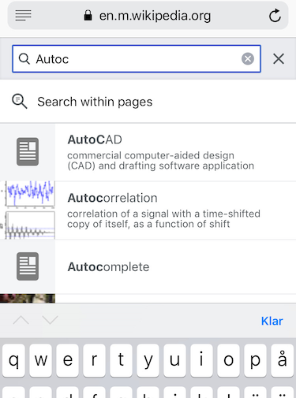

# Lab 2: Autocomplete

In this lab your task is to implement autocomplete for a given set of terms, where a term consists of a string and an associated nonnegative weight. That is, given a prefix, find all queries that start with the given prefix, in descending order of weight.

## About the labs

- Labs must be done in groups. If you absolutely cannot work together with your previous lab partners, contact Christian, Peter or Nick.
- Each lab has two deadlines. By the first deadline you must submit at least a partial attempt at solving the lab. The lab will be marked and you will get feedback. By the second deadline, you must submit a complete and correct solution. If you are unsure if you have solved the lab correctly, please ask at a lab session!
- The lab is part of the examination of the course. Therefore, you must not copy code from or show code to other groups. You are welcome to discuss ideas with one another, but anything you submit must be **the work of you and your lab partners**.
- Please read [the general instructions on how to run the labs](https://chalmers.instructure.com/courses/10681/pages/running-the-labs-command-line-eclipse-or-intellij).

## Getting started

Start by downloading and unzipping **[Lab2.zip](https://chalmers.instructure.com/courses/10681/files/folder/Labs)**. It contains the following classes:

- **Term.java**: autocompletion terms
- **RangeBinarySearch.java**: two different binary search algorithms
- **Autocomplete.java**: the autocompletion engine
- **AutocompleteCLI.java**: a command line interface to the autocompleter
- **AutocompleteGUI.java**: a graphical interface to the autocompleter

as well as a directory of **dictionaries**, and a file **answers.txt** where you will write down answers to questions in the lab.

You should be able to compile all files, but when you try to run them you will get a runtime error:

```
$ javac AutocompleteCLI.java
$ java AutocompleteCLI dictionaries/romaner.txt 5
Dictionary size: 83334
Write a prefix and press enter, quit by just pressing enter
? pen
Number of matches: 0
java.lang.NullPointerException
	at AutocompleteCLI.main(AutocompleteCLI.java:59)
```

## Background

In this lab your task is to implement autocomplete for a given set of terms, where a term consists of a string and an associated nonnegative weight. That is, given a prefix, find all queries that start with the given prefix, in descending order of weight.

Autocomplete is pervasive in modern applications. As the user types, the program predicts the complete query (typically a word or phrase) that the user intends to type. Autocomplete is most effective when there are a limited number of likely queries. For example, Wikipedia uses it to display matching page titles as the user types; search engines use it to display suggestions; cell phones use it to speed up text input.

| Wikipedia search | Web search | SMS suggestions |
|------------------|------------|-----------------|
|  |  |  |

In these examples, the application predicts how likely it is that the user is typing each query and presents to the user a list of the top-matching queries, in descending order of weight. These weights are determined by historical data, such as box office revenue for movies, frequencies of search queries from other Google users, or the typing history of a cell phone user. For the purposes of this assignment, you will have access to a set of all possible queries and associated weights (and these queries and weights will not change).

The performance of autocomplete functionality is critical in many systems. For example, consider a search engine which runs an autocomplete application on a server farm. According to one study, the application has only about 50ms to return a list of suggestions for it to be useful to the user. Moreover, in principle, it must perform this computation for every keystroke typed into the search bar and for every user!

In this assignment, you will implement autocomplete by (1) sorting the terms alphabetically; (2) binary searching to find all query strings that start with a given prefix; and (3) sorting the matching terms by weight. 

## Part 1: The autocompletion term

Write a class `Term` that represents an autocompletion term: a string and an associated integer weight. You must implement the following API, which supports comparing terms by three different orders:

- [case-insensitive lexicographic order](https://docs.oracle.com/javase/8/docs/api/java/lang/String.html#compareToIgnoreCase-java.lang.String-);
- in descending order by weight; and
- case-insensitive lexicographic order, but using only the first *k* characters – this order may seem a bit odd, but you will use it in Part 3 to find all words that start with a given prefix (of length *k*)

```
public class Term:
    ...
    // Compares the two terms in case-insensitive lexicographic order.
    public static Comparator<Term> byLexicographicOrder()

    // Compares the two terms in descending order by weight.
    public static Comparator<Term> byReverseWeightOrder()

    // Compares the two terms in case-insensitive lexicographic order,
    // but using only the first k characters of each word.
    public static Comparator<Term> byPrefixOrder(int k)
```

To get case-insensitive lexicographic order, you should use the String method `.compareToIgnoreCase(…)`.

#### Performance requirements

- The string comparison functions should take time proportional to the number of characters needed to resolve the comparison.

## Part 2: Binary search for a range

When binary searching a sorted array that contains more than one key equal to the search key, the client may want to know the index of either the first or the last such key. Accordingly, implement the class `RangeBinarySearch` with the following API:

```
public class RangeBinarySearch:
    // Returns the index of the *first* element in terms[] that equals the search key,
    // according to the given comparator, or -1 if there are no matching elements.
    // Complexity: O(log N), where N is the length of the array
    public static int firstIndexOf(Term[] terms, Term key, Comparator<Term> comparator)

    // Returns the index of the *last* element in terms[] that equals the search key,
    // according to the given comparator, or -1 if there are no matching elements.
    // Complexity: O(log N)
    public static int lastIndexOf(Term[] terms, Term key, Comparator<Term> comparator)
```

You should assume that the argument array is in sorted order (with respect to the supplied comparator).

#### Performance requirements

- The methods `.firstIndexOf(…)` and `.lastIndexOf(…)` should make at most 1 + ⌈log<sub>2</sub> *N*⌉ compares in the worst case, where *N* is the length of the array.
- In this context, a compare is one call to `comparator.compare(…)`.

## Part 3: Autocompletion

In this part, you will implement a data type that provides autocomplete functionality for a given set of string and weights, using `Term` and `RangeBinarySearch`. To do so, (i) sort the terms in lexicographic order; (ii) use binary search to find all terms that start with a given prefix; and (iii) sort the matching terms in descending order by weight. Organize your program by creating the class `Autocomplete` with the following API:

```
public class Autocomplete:
    private Term[] dictionary

    // Initializes the dictionary from the given array of terms.
    public Autocomplete(Term[] dictionary):
        this.dictionary = dictionary;
        sortDictionary()

    // Sorts the dictionary in *case-insensitive* lexicographic order.
    // Complexity: O(N log N), where N is the number of terms
    private void sortDictionary()

    // Returns all terms that start with the given prefix, in descending order of weight.
    // Complexity: O(log N + M log M), where M is the number of matching terms
    public Term[] allMatches(String prefix)

    // Returns the number of terms that start with the given prefix.
    // Complexity: O(log N)
    public int numberOfMatches(String prefix)
```

#### Performance requirements

- The method `.sortDictionary()` should make proportional to *N* log *N* compares (or better) in the worst case, where *N* is the number of terms.
- The method `.allMatches(…)` should make proportional to log *N* + *M* log *M* compares (or better) in the worst case, where *M* is the number of matching terms.
- The method `.numberOfMatches(…)` should make proportional to log *N* compares (or better) in the worst case. It should not depend on *M*.
- In this context, a *compare* is one call to the `.compare(…)` method provided by any of the comparators defined in `Term`.

## Input format

We provide a number of sample input files for testing. Each file consists of a number of pairs of strings and nonnegative weights. There is one pair per line, with the weight and string separated by whitespace. A weight can be any integer between 0 and 2<sup>63</sup>−1. The string can be an arbitrary sequence of Unicode characters, including spaces (but not newlines).

- **wiktionary.txt** contains the 10,000 most common words in Project Gutenberg, with weights proportional to their frequencies.

  ```
    5627187200	the
    3395006400	of
    2994418400	and
    2595609600	to
                ...
        392402  wench
        392323  calves
  ```

- **cities.txt** contains 93,827 cities, with weights equal to their populations.

  ```
      14608512	Shanghai, China
      13076300	Buenos Aires, Argentina
      12691836	Mumbai, India
      12294193	Mexico City, Distrito Federal, Mexico
                ...
             2	Grytviken, South Georgia and The South Sandwich Islands
             2	Al Khāniq, Yemen
  ```

- **romaner.txt** contains all 83,334 [non-hapax](https://en.wikipedia.org/wiki/Hapax_legomenon) words from a selection of [69 Swedish novels](https://spraakbanken.gu.se/eng/resource/romi), with weights proportional to their frequencies.

  ```
       190569  och
       128893  att
       107002  det
       104153  i
               ...
       2       020
       2       00vad
  ```

- **gp2011.txt** contains all 261,201 non-hapax words from [Göteborgsposten 2011](https://spraakbanken.gu.se/eng/resource/gp2011), with weights proportional to their frequencies.

  ```
       476575  och
       476240  i
       414059  att
       292398  är
               ...
       2       074
       2       0565
  ```

- **nordsamiska.txt** contains 41,530 common words in [Northern Sami](https://repo.clarino.uib.no/xmlui/handle/11509/106), with weights proportional to their frequencies.

  ```
      17       soabadanráđđi
      12       láigoboađđu
      211      ovddemus
      11       tastatuvra
               ...
      12       observeret
      19       čohkiidus
  ```

## Wrapping up: The command-line client

You can test that your code works by downloading and running the provided command-line client **AutocompleteCLI.java**.

The client takes the name of an input file and an integer `max_matches` as command-line arguments. It reads the data from the file; then it repeatedly reads autocomplete queries from standard input, and prints out the top `max_matches` matching terms in descending order of weight. Like this:

```
$ javac AutocompleteCLI.java
$ java AutocompleteCLI dictionaries/romaner.txt 5
Dictionary size: 83334
Write a prefix and press enter, quit by just pressing enter
? and
Number of matches: 104
        7659    andra
         699    Anders
         625    Andro
         371    andre
         295    andan
? 42
Number of matches: 2
          10    42
           2    425
? c
Number of matches: 929
        1032    Charles
         563    Caesar
         397    chans
         286    cigarrett
         253    Claudia
? flaggstångsknopp
Number of matches: 0

$ java AutocompleteCLI dictionaries/cities.txt 7
Dictionary size: 93827
Write a prefix and press enter, quit by just pressing enter
? Gö
Number of matches: 64
      504084    Göteborg, Sweden
      122149    Göttingen, Germany
       58040    Göppingen, Germany
       57751    Görlitz, Germany
       40763    Gönen, Turkey
       34243    Göksun, Turkey
       32374    Gödöllő, Hungary
? Al M
Number of matches: 39
      431052    Al Maḩallah al Kubrá, Egypt
      420195    Al Manşūrah, Egypt
      290802    Al Mubarraz, Saudi Arabia
      258132    Al Mukallā, Yemen
      227150    Al Minyā, Egypt
      128297    Al Manāqil, Sudan
       99357    Al Maţarīyah, Egypt
```

***Important***: You should get results similar to the ones above! Make sure you're returning the same number of matches, and that you use case-insensitive comparisons.

## Interactive GUI (optional, but fun and no extra work)

There is a GUI version too, called **AutocompleteGUI.java**. The program takes the name of a file and an integer `max_matches` as command-line arguments and provides a GUI for the user to enter queries. It presents the top `max_matches` matching terms in real time. When the user selects a term, the GUI opens up the results from a Google search for that term in a browser.

```
$ javac AutocompleteGUI.java
$ java AutocompleteGUI dictionaries/gp2011.txt 10
```

## Your submission

- You may not call any library functions other than those in `java.lang` or `java.util` in your implementation.
- Answer the questions that are in the file **answers.txt**.
- Submit the following files:
  - **Term.java**
  - **RangeBinarySearch.java**
  - **Autocomplete.java**
  - **answers.txt**, with all questions answered

## Optional tasks

If you would like an extra challenge, here are some suggestions for things you could do:

- Use locales when doing the comparisons, instead of the simple lexicographic order, so that e.g. *a*, *á* and *A* are all treated as equal, but *a* and *ä* are not. See the [tutorial on comparators](https://chalmers.instructure.com/courses/10681/pages/comparables-and-comparators) for more information.

- Calculate a frequency distribution of your own from a corpus. Corpora can e.g. be downloaded from [Språkbanken Text](https://spraakbanken.gu.se/resurser) or the [Leipzig Corpora Collection](https://wortschatz.uni-leipzig.de/en/download).

- (advanced) Fuzzy autocomplete. This should be possible in the following (sketchy) way:
  - Create a new list ("1-deleted") with all possible results from deleting one character from the original dictionary.
      - you need to decide about a cost for deleting a character, which should be used to reduce the original term weight
  - When looking up a prefix:
      - lookup the prefix in the original dictionary
      - lookup the prefix in the list of 1-deleted terms
      - delete one character from the prefix and lookup in (1) the original dictionary, and (2) in the 1-deleted terms
  - You can do the same for 2-deleted terms, and 3-deleted terms, but notice that the number of terms will explode.

## Acknowledgements

This assignment was conceived by Matthew Drabick and Kevin Wayne (©2014), with some changes to fit TDA417+DAT038.
