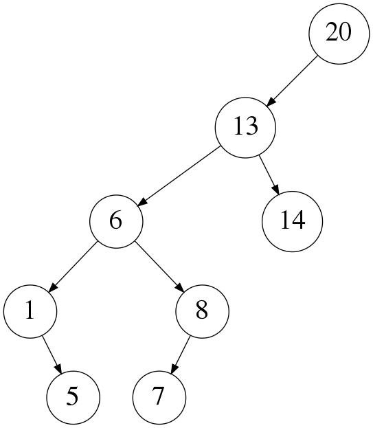
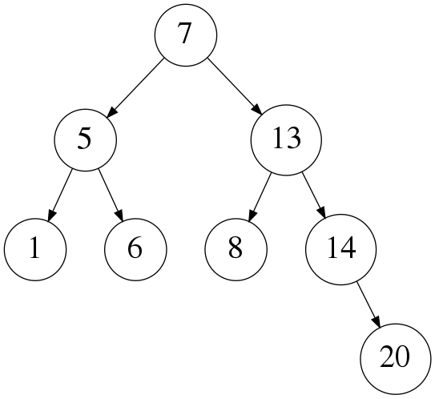

# Lab 3: Plagiarism detection (description)

In this lab your task is to modify a plagiarism detection program so
that it makes better use of data structures. You will also implement
important parts of a balanced BST data structure called a _scapegoat tree_.

## About the labs

- Labs must be done in groups. If you absolutely cannot work together with your previous lab partners, contact Christian, Peter or Nick.
- Each lab has two deadlines. By the first deadline you must submit at least a partial attempt at solving the lab. The lab will be marked and you will get feedback. By the second deadline, you must submit a complete and correct solution. If you are unsure if you have solved the lab correctly, please ask at a lab session!
- The lab is part of the examination of the course. Therefore, you must not copy code from or show code to other groups. You are welcome to discuss ideas with one another, but anything you submit must be **the work of you and your lab partners**.
- Please read [the general instructions on how to run the labs](https://chalmers.instructure.com/courses/10681/pages/running-the-labs-command-line-eclipse-or-intellij).

## Background

You are head of the Anti-Cheating Department at Palmers University of Mythology, where you are in charge of catching students who copy each others' work.

You recently bought a very expensive *plagiarism detection program*. The program has the following job: it reads in a set of documents, finds similarities between them and reports all pairs of documents that seem suspiciously similar.

You were very impressed with the program when you saw the salesperson demonstrate it on some small examples. Unfortunately, once you bought the program you realised that *it is extremely slow when given a large number of documents to check*. Reading the source code, you noticed that the program does not use appropriate data structures and therefore its time complexity is poor. (At Palmers University of Mythology, employees are expected to have taken a Data Structures course.)

In this lab, your task is to *speed up the plagiarism detection program* so that it works on much larger document sets. The lab has three parts:

1. Analyse the time complexity of the plagiarism detection program.
2. Speed up the program by modifying it to use appropriate data structures - in particular, a map implemented using a binary search tree.
3. Speed up the program further by implementing a kind of balanced BST known as a *scapegoat tree*, and re-analyse the program's complexity.

## Getting started

Your first task is to make sure that you can run the plagiarism detection program. Start by downloading and unzipping **[Lab3.zip](https://chalmers.instructure.com/courses/10681/files/folder/Labs)**. It contains Java source files as well as a directory of **documents**, and a file **answers.txt** where you will write down answers to questions in the lab. There are four document sets of various sizes called **small**, **medium**, **big** and **huge**, plus an extra set **badforbst** which you should ignore for now. All the document sets are collections of Wikipedia pages (downloaded automatically by following random links from a starting page).

**Lab3.java** contains the main program. It accepts a command line option which should be the name of a directory containing plain text files to check. If run without options it will prompt for a directory.

Now compile **Lab3.java** and run it on the directory **small**. If
you are using the command line, you can do this with:

```
javac *.java
java Lab3 documents/small
```

If you are using an IDE, please see [Running the labs](https://chalmers.instructure.com/courses/10681/pages/running-the-labs-command-line-eclipse-or-intellij) for more information.

After a few seconds you should see the following output (probably with different timings):

```
Reading all input files took 0.12 seconds
Building n-gram index took 0.00 seconds
Computing similarity scores took 2.62 seconds
Finding the most similar files took 0.00 seconds
In total the program took 2.76 seconds

BST balance statistics:
  files: BST, size 7, height 6
  index: BST, size 0, height -1
  similarity: BST, size 16, height 15

Plagiarism report:
   80 similarity: small/Plagiarism.txt and small/Find me.txt
   52 similarity: small/Rogeting.txt and small/Find me.txt
   32 similarity: small/To be, or not to be.txt and small/Hamlet.txt
   30 similarity: small/To be, or not to be.txt and small/Find me.txt
```

The program's main output is the plagiarism report at the bottom. The report lists *pairs* of files which have similar content, together with a number indicating how similar they are (the next section describes how this number is calculated). Here we can see that "Find me.txt" has similar content to several other files. In fact, if you look in these files you will see that "Find me.txt" is heavily plagiarised. "Hamlet.txt" and "To be, or not to be.txt" are also similar, but not plagiarised.

We also see some performance statistics, including timings for the various phases of the program. We see that in total, the program took 2.8 seconds to run, and that almost all the time is in what is reported as "computing similarity scores". We also see statistics about the size (number of nodes) and height (number of levels) of the various BSTs that the program creates. (In this lab, we define height slightly different from the slides, but the same as the book: the empty tree has height –1, and a single leaf node has height 0.)

Now try running the program on the medium directory, which consists of about 100 files. You will find that it takes a while. Go on and read the next section while you wait! Once the program is finished, write down how long it took – you will need the answer later.

## How the program measures similarity

One way to measure the similarity of two documents is to count how many words they have in common. However, this approach leads to false positives because the same set of words can be used in two very different documents. A better way is to count n-grams. An n-gram is a sequence of n consecutive words in a document or string. For example, the string "the fat cat sat on the mat" contains the 5-grams "the fat cat sat on", "fat cat sat on the" and "cat sat on the mat".

Given two documents, we will define their similarity score as the number of 5-grams that appear in both documents - that is, the size of the intersection of the two documents' sets of 5-grams. For example, "the fat cat's hat sat on the mat" and "the cat's hat sat on the mat" have two 5-grams in common – "cat's hat sat on the" and "hat sat on the mat" – and therefore have a similarity score of 2. A high similarity score means that a lot of content is shared between the documents, and is a possible sign of plagiarism.

## How the program works

The plagiarism detection program consists of the following files:

- **Lab3.java**: the main program
- **Ngram.java**: a class for representing and computing n-grams
- **PathPair.java**: a class that represents a pair of filenames.
- **BST.java**: a map implemented using a binary search tree.
- **ScapegoatTree.java**: a map implemented using a scapegoat tree. Unfinished; you will complete it later.

The program uses a simple heuristic to detect plagiarism: *any pair of files with a similarity score of at least 30 is suspicious*. Its basic algorithm is: find all such pairs of files, and print them out, sorted in decreasing order of similarity. In case there are many results, only the top 50 are printed.

In order to implement this algorithm, **Lab3.java** builds two main data structures, both of which are maps:

- `BST<Path, Ngram[]> files`: contains the contents of all input documents. The key is a filename, and the value is an array containing all 5-grams of that file.
- `BST<PathPair, Integer> similarity`: contains the similarity scores of all document pairs. The key is a *pair* of filenames, and the value is the similarity score of those two files.

In more detail, **Lab3.java** consists of four methods (plus a main method), each of which is called in turn:

1. `readPaths`: Reads in each document and computes its 5-grams.
   Returns the map `BST<Path, Ngram[]> files`.
2. `buildIndex`: currently does nothing! You will add code to this method later.
3. `findSimilarity`: Computes the similarity score of each pair of documents.
   Returns the map BST<PathPair, Integer> similarity.
4. `findMostSimilar`: Given the similarity scores, produces an array containing all pairs of files having similarity at least 30, sorted in decreasing order of similarity, and only including the top 50 results.
   Returns an `ArrayList<PathPair> mostSimilar` containing the sorted list.

The `main` method executes these four methods in turn, then simply prints out each `PathPair` in `mostSimilar`, together with its similarity (which can be found in the `similarity` BST).

**Why is it slow?** In the output above, most of the time was spent in the "Computing similarity scores" step. This corresponds to `findSimilarity`, step 3 in the algorithm above. The `findSimilarity` method is currently programmed using the following brute-force algorithm:

```
for each document d1:
    for each document d2 ≠ d1:
        for each 5-gram n1 in d1:
            for each 5-gram n2 in d2:
                if n1 = n2:
                    increase the similarity of d1 and d2 by 1
```

Make sure you understand how this algorithm works. Also, read the source code for `findSimilarity` and make sure you understand that too. (Ignore the unused `index` parameter to that method for now.)

You can see lots of nested loops here which should be a warning sign for *bad complexity*! As we saw, most of the program's runtime is spent executing this algorithm. If we want to run **Lab3.java** on larger document sets, we will have to eliminate this brute force search!

### Task 1: Complexity analysis

Now answer the following questions (write your answers in the answers.txt file provided).

- What is the time complexity of `findSimilarity`? Assume that basic operations such as array accesses and comparisons take a constant amount of time. Your answer should be in terms of *N*, where *N* is the total number of 5-grams in the document set. You may assume that all documents are the same length (have the same number of 5-grams). You may also assume that there is not much plagiarised text; specifically, that most 5-grams occur in only one file, and the number of 5-grams that occur in more than one file is a *small constant*.

  **Hint:** If you get stuck, try analysing it the following way: let *D* be the number of documents and *K* be the number of 5-grams per document. First find an expression for the complexity in terms of both *D* and *K*. Then use the fact that *N = D·K* to find an expression in terms of *N*.

- Here are the approximate number of 5-grams in the four document sets: **small** (*N* = 20,000), **medium** (*N* = 200,000), **big** (*N* = 2,000,000), and **huge** (*N* = 4,000,000). How long did the program take to run on the **small** and **medium** directories? Is the ratio between the runtimes as you would expect, given the complexity? Explain very briefly why.

  **Hint:** You might find that the program takes *longer* than you would have predicted on the **medium** document set. I think the reason is that the **medium** set contains more plagiarised text than the **small** set, whereas your analysis assumes the amount of plagiarised text is constant. My numbers for example were about 2x slower than predicted.

- How long do you predict the program would take to run on the **huge** directory? (If your theoretical and empirical results were different, you can use either to make your prediction.)

## Using the right data structure

The `findSimilarity` method is slow because it has to search through
all pairs of 5-grams, even though it only wants the pairs that are equal.
Let's fix this by improving the program's use of data structures.

The data structure you will add is an index that, given a 5-gram, allows us to figure out which files contain that 5-gram. We can represent this index as a map, where the key is a 5-gram and the value is a list of all filenames that contain the 5-gram:

```
BST<Ngram, ArrayList<Path>> index;
```

In fact, **Lab3.java** contains a declaration for just such a map. The `buildIndex` method is supposed to create an index. The index returned by `buildIndex` is then passed in to `findSimilarity`. However, currently `buildIndex` does not build the index (it returns an empty map) and `findSimilarity` does not bother to use it.

### Task 2: Make use of an index

Here are your tasks:

1. Finish the implementation of `buildIndex`. You have access to the parameter `BST<Path, Ngram[]> files` which contains the 5-grams of each file, as described above. The method should return a BST containing all 5-grams containing in all input files; the value associated with a 5-gram should be the list of files containing that 5-gram (in any order).

   Note that the `Ngram` class already implements the `Comparable<Ngram>` interface, so you do not need to implement any extra code to be able to compare 5-grams. Also, **BST.java** is already implemented for you – you do not have to create your own binary search tree implementation.

2. Modify `findSimilarity` so that it makes appropriate use of `index`. You will have to think how best to do this! The goal is to replace brute-force searches by lookups in `index`.

You do not need to modify any methods except for `buildIndex` and `findSimilarity`. In fact, you do not even need to understand the code of the other methods (although it does not hurt to read them).

**Hint:** the API supported by **BST.java** is the one described in the book and in the [Course API](https://chalmers.instructure.com/courses/10681/pages/course-api-interfaces-and-classes) page on Canvas. If you are not sure about how to program with this API, the method `findSimilarity` illustrates the ways in which you can use it. If you are not sure how to program with maps more generally, try section 3.5 of the book or the lecture on applications of BSTs.

When you are finished, re-run your program. It previously took a few minutes to execute on the medium directory; now it should take a few seconds at most. Great!

Depending on exactly how you implemented `findSimilarity`, you may find that your program also runs on **large** and **huge**, or that you get a stack overflow error. This just depends on whether your algorithm tends to produce unbalanced BSTs. If it doesn't work, don't worry, you will fix it in the next section!

If you run your program on the **badforbst** document set (*N* = 40,000), you will get a stack overflow exception. This is because this directory is specially designed to cause `index` to become unbalanced (if you look at the contents of this directory, you should see why). As usual, we see that BSTs must be somewhat balanced if we want to have good performance.

**Questions.** Now answer the following question:

- Which of the BSTs in the program usually become unbalanced? (The program prints the size and height of all its BSTs.)

Here is an **optional extra question** for those who are interested:

- Is there a simple way you could prevent these BSTs from becoming unbalanced?

## Implementing a scapegoat tree

In order to prevent the binary search trees created by the program from becoming too unbalanced, your final task is to implement a balanced BST data structure called a *[scapegoat tree](http://jeffe.cs.illinois.edu/teaching/algorithms/notes/10-scapegoat-splay.pdf)* (visualisation available in [Gnarley trees](https://chalmers.instructure.com/courses/10681/pages/additional-resources)).

### How scapegoat trees work

**Rebuilding.** Scapegoat trees are based on an operation called *rebuilding*, which takes a BST and transforms it to be *perfectly balanced* (height = lg n). Rather than trying to carefully rearrange the input BST to be balanced, rebuilding first reads the contents of the input BST and then creates from scratch a balanced BST having the same contents.

In more detail, to rebuild a BST we perform the following two steps:

1. First we convert the BST into a *sorted array* of key-value pairs. We can do this using an in-order traversal.
2. Then we build a new, balanced BST from the sorted array. We can do this by a recursive algorithm where we choose the middle element of the array as the root and then recursively convert the left and right halves of the array into BSTs.

The figure below shows an example: on the left, a BST; in the middle, flattened to a sorted array; on the right, converted back to a balanced BST.

| Unbalanced subtree | Flattened to an array | After rebuilding |
|-----------------------|-----------------------|------------------|
|  | `{1,5,6,7,8,13,14,20}` |  |

**Scapegoat invariant.** When implementing a scapegoat tree, we first choose a constant α > 1 called the *balance factor*, which controls how unbalanced the tree is allowed to be. The scapegoat tree invariant is that each subtree's height must be within a factor of α of the optimal height. More precisely, every scapegoat tree satisfies the following balance invariant:

- Each node in the tree must satisfy *h* ≤ α lg *s*, where *h* and *s* are the height and size of the subtree rooted at that node.
For this invariant to work, we will define the empty tree (null) to have a height of –1, so that a leaf node has a height of 0. This matches the definition used in the book but is different from the lecture slides. Both definitions are reasonable in practice.

**Scapegoat insertion.** To insert a new key-value pair into a scapegoat tree, we use the following algorithm:

- First, add the key-value pair to the tree using the BST insertion algorithm. This may break the balance invariant because the newly-created node may increase the tree's height.
- Starting at the newly-created node, go upwards in the tree (visiting all ancestors of the newly-created node), looking for nodes that violate the balance invariant.
- Whenever we find a node that violates the balance invariant, *rebuild the subtree rooted at that node*.

In order to efficiently check if a node violates the balance invariant, we are going to add two fields to each node, `size` and `height`, which record the size and height of the subtree rooted at that node. Of course, the insertion algorithm must keep these fields up-to-date whenever it modifies the tree.

Putting this all together, here is a recursive formulation of `put(node, key, value)`:

- If we are in a base case (`node == null`, or `node.key` is equal to `key`) then do the same as in BST insertion.
- Otherwise, recursively call either `put(node.left, key, value)` or `put(node.right, key, value)`, again using the same logic as BST insertion.
- Update the node's `height` and `size` fields by looking at `node.left` and `node.right`.
- If `node.height > α lg node.size`, then rebuild the subtree rooted at this node.
(Notice that we do not explicitly perform the "go upwards in the tree" step. You may want to convince yourself that we get the same effect because of how the recursion is structured.)

**Scapegoat performance.** Scapegoat trees guarantee that the height of the tree is logarithmic and therefore `get` takes logarithmic time. While rebuilding a subtree takes linear time, it turns out that rebuilding does not happen too often and `put`/`delete` end up taking *amortised* logarithmic time. So, scapegoat trees have the same complexity as red-black BSTs, while being somewhat simpler to implement.

### Task 3: Finish the scapegoat tree implementation

In **ScapegoatTree.java**, you will find an *unfinished* implementation of scapegoat trees. Your job is to finish the implementation, and use it in **Lab3.java**.

Start by changing **Lab3.java** so that it uses **ScapegoatTree.java** rather than **BST.java**. The two modules have the same API, so you only have to search and replace `BST` with `ScapegoatTree`. The program will crash because not everything is implemented.

Looking at the code, you will find that most of the code is done, but
three methods are not implemented (rather, they throw an
`UnsupportedOperationException`). Your job is to implement these three
methods! Below is a description of what methods you need to implement.

The method `Node rebuild(Node node)` implements the rebuilding
operation described above. It takes a node, rebuilds the subtree
rooted at that node, and returns the new subtree. This method is
already implemented - but it calls two methods, `inorder` and
`balanceNodes`, which are not implemented yet. **You have to implement
these methods.** Here is how they should work:

- `void inorder(Node node, ArrayList<Node> nodes)`: this method
  converts a BST into a sorted array of nodes. It should perform an
  in-order traversal of the subtree rooted at `node`, adding every
  node it visits to the ArrayList `nodes`.

  **Hint:** there is a very similar algorithm in the lectures and in
  section 3.2 of the book.

- `Node balanceNodes(ArrayList<Node> nodes, int lo, int hi)`:
  this method converts a sorted array of nodes into a balanced BST.
  It takes three parameters: `nodes` is the sorted ArrayList of nodes,
  and `lo` and `hi` represent the part of the array that we want to
  convert. It should return a perfectly balanced BST containing all
  the key-value pairs in the subarray `nodes[lo]..nodes[hi]`.

  (Here, "perfectly balanced" doesn't mean that the two children of
  each node have the same height, as this is not always possible.
  It just means that the tree's height is as small as possible.)

  This method uses _divide and conquer_. It should work as follows:

  * First, it computes the midpoint of `lo` and `hi`.
    The key-value pair at this midpoint will be the root of the BST.
  * Then it uses recursion to convert 1) the nodes before the
    midpoint and 2) the nodes after the midpoint into balanced BSTs.
    These BSTs become the children of the root.
  * Finally, it should set the `size` and `height` fields of the root
    node, and return it.

  **ScapegoatTree.java** currently contains the start of an
  implementation of `balanceNodes`. It handles the base case (when the
  part of the array to convert is empty), and computes the midpoint.
  You should complete the implementation, following the algorithm above.

  **Hint:** there is a method `int height(Node node)` which reads the
  height field of a node, but also works if the node is `null`.

The method `Node put(Node node, Key key, Value value)`, which adds a
key/value pair to the subtree rooted at `node`, is also not
implemented yet. **You should implement this method too**, following the
recursive algorithm for `put` given earlier. (Make sure you are
looking at the right `put` method. There is another `put` method that
does not take a `Node` parameter, but you don't need to do anything
with that one.) **Hints:**

- You may start from the `put` implementation in **BST.java** (which is the same as in the book)! Just copy and paste it in into **ScapegoatTree.java**. This code even maintains the size field for you. You will then need to add code to: 1) maintain the `height` field; 2) call the `rebuild` method when necessary.
- The `ScapegoatTree` class defines some other handy methods which you will find useful:
  - `int height(Node node)` and `int size(Node node)`: these normally just read the height/size fields of the node. However, they also work if the node is null.
  - `int log2(int n)`: calculates *lg n* (used when checking the balance invariant).
  - `int alpha`: this field contains the value of the balance factor (the α that appeared in the invariant). It is defined to be 2, but feel free to change it (to something > 1).

*The only methods you need to change are inorder, balanceNodes and put – and only the version of put that takes a Node parameter.*

**Debugging.** When you have finished implementing the methods, run **Lab3.java** but *make sure to enable assertions*! The assertions will check that, after each call to `put`, all the invariants hold – the BST invariant, the scapegoat balance invariant, and also that the `size` and `height` fields are correct. So if you have a bug, running with assertions has a high chance of finding it. To check assertions, pass the `-ea` flag as the *first parameter* when running Java:

```
java -ea Lab3
```

If you are using an IDE, here are [instructions for IntelliJ](https://stackoverflow.com/questions/18168257/where-to-add-compiler-options-like-ea-in-intellij-idea/18168305#18168305) and [for Eclipse](https://stackoverflow.com/questions/5509082/eclipse-enable-assertions/5509180#5509180).

You will find that with assertions enabled, the code runs *very very slowly*... but you should still be able to try it on the *small* directory (it took about 90s to run for me). Make sure that it works and fix any assertion errors you find.

**Running it for real.** Now you are ready to try the plagiarism detector again. *Switch off assertions first*!

Run Lab3 on all of the document sets: **small**, **medium**, **big**, **huge** and **badforbst**. You should find that all of them work, and none of them should take more than a few minutes. If you like, you can look for plagiarised text in the sample document sets!

**Complexity analysis.** Finally, re-do the complexity analysis that you did at the beginning by answering the same question as before:

- What is the time complexity of running `buildIndex` and `findSimilarity` in turn? Assume that the document set contains a total of *N* 5-grams. Also assume that there is not much plagiarised text; specifically, the number of 5-grams that occur in more than one file is a *small constant*.

  You will most likely need the following complexity facts (some of them are only true when using amortised analysis, but you may assume them now anyway):

  - Creating or adding to an `ArrayList` takes _O(1)_ time.
  - Adding an item to a scapegoat tree of size *N* takes _O(log N)_ time.

  Your answer should be a single formula representing the total runtime of buildIndex and findSimilarity.

Here is an **optional extra question**:

- In our complexity analysis, suppose we drop the assumption that there is not much plagiarised text. What is the program's complexity in terms of *N* and *S*, where *S* is the total similarity score across all pairs of files?

## Looking back on what you have done

By introducing an extra data structure (an index from n-grams to files), you managed to speed up the execution of the plagiarism detection program enormously. You can check a document set in seconds that would have taken hours before, just by introducing one index. These are the kind of gains you get by basing your program on suitable data structures.

With some patience, you could now check a much larger set of documents – say 1GB. This might take an hour or so – but in the version of the program you started with, it would have taken about *5 years*!

We also saw that almost all of the program's runtime was spent in one small subtask. Seeing that our program was slow, it would have been a total waste of time to optimise the part that reads in the files, or that ranks the similarity scores. On the other hand, by focusing on the right part of the program, huge gains were possible. Try to remember Knuth's famous quote:

- "We should forget about small efficiencies, say about 97% of the time: premature optimization is the root of all evil. Yet we should not pass up our opportunities in that critical 3%."

You also implemented scapegoat trees, and saw that they avoid the problems caused by unbalanced BSTs. Plain BSTs are a little too unreliable for general use, and it is usually worth spending the extra effort to add balancing. In real life though, you would use e.g. a Java [TreeMap](https://docs.oracle.com/javase/8/docs/api/java/util/TreeMap.html) or [HashMap](https://docs.oracle.com/javase/8/docs/api/java/util/HashMap.html), instead of implementing your own BST. When programming, make sure you know your programming language's standard library of data structures.

Of course, a real plagiarism detection program should have many more features, and some possible feature ideas are listed below - but when processing text on this scale, behind every fancy detection feature there needs to be a smart data structure!

## Your submission

You should submit the following files:

- **Lab3.java**
- **ScapegoatTree.java**
- **answers.txt**, with all (non-optional) questions answered

*Do not change the file names! And do not declare them as part of a package!*

***Note:*** if you do a resubmission, Canvas may display your files as Lab3-1.java, answers-66.txt etc. This is normal and nothing to worry about.

## Lots of optional tasks

Here are a few ideas for things to do if you want to learn more. These are just a few possible starting points – robust plagiarism detection is a difficult and open-ended problem!

- Calculate what n-grams are most common and least common. When scoring similarity, weight less common shared n-grams higher. Or weight n-grams using [tf-idf](https://en.wikipedia.org/wiki/Tf%E2%80%93idf).

- Rather than just counting how many 5-grams two documents have in common, count n-grams for lots of different values of n simultaneously. Harder: measure similarity by the *longest* n-gram that two documents have in common. (I'm not sure how to do this efficiently! Perhaps there is some clever way using a suffix tree?)

- Make the similarity score more robust. For example, figure out how to catch plagiarists who use a thesaurus to replace words by synonyms (is there a way for the program to normalise texts, e.g., replacing each word by its "best" synonym?) Similarly, deleting or inserting words from the text reduces the number of matching n-grams – can we fix that?

- Can this method be used to find plagiarised code? One problem is that many files often contain the same standard boilerplate (e.g. licence text, standard loop structures, ...), which leads to high plagiarism scores - can this be fixed?

- Implement hash tables and compare the performance.

- Implement treaps or red-black BSTs.

- Implement deletion for scapegoat trees. The idea is to use lazy deletion (as discussed in lecture 5), but when more than 50% of the tree nodes are tombstone nodes, rebuild the entire tree.

- Recall that scapegoat trees use a parameter α to determine how unbalanced the tree is. Experiment with different values of α and see the effect on performance and tree height. Empirically determine a good value of α.

- It turns out that scapegoat trees can be implemented without storing the height and size in each node. In fact, no extra information needs to be stored in each node at all. For more information, see http://jeffe.cs.illinois.edu/teaching/algorithms/notes/10-scapegoat-splay.pdf or http://opendatastructures.org/versions/edition-0.1g/ods-python/8_1_ScapegoatTree_Binary_Se.html. Try implementing this.

## Acknowledgements

This lab is inspired by the "Catching Plagiarists" lab by Baker Franke.
